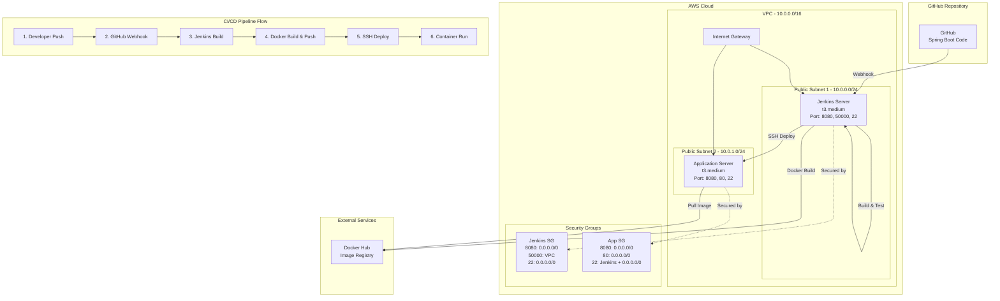

# Spring Boot CI/CD Infrastructure with Terraform

이 프로젝트는 Spring Boot 애플리케이션을 위한 완전 자동화된 CI/CD 파이프라인 인프라를 Terraform으로 구성합니다.

**목표**: 수동 배포를 제거하고, 신속하고 안정적인 자동화된 배포 환경을 구축

## 🏗️ 인프라 아키텍처



## 📋 구성 요소

| **구성 요소**          | **설명**                           | **포트**        |
| ---------------------- | ---------------------------------- | --------------- |
| **Jenkins Server**     | CI/CD 파이프라인 실행, Docker 빌드 | 8080, 50000, 22 |
| **Application Server** | Spring Boot 애플리케이션 실행      | 8080, 80, 22    |
| **VPC & Subnets**      | 네트워크 격리 및 가용성 확보       | 10.0.0.0/16     |
| **Security Groups**    | 최소 권한 원칙의 방화벽 규칙       | 계층별 보안     |
| **SSH Key Pairs**      | 안전한 서버 접근 관리              | RSA 4096bit     |

## 🔗 CI/CD 파이프라인 흐름

```bash
1. 개발자가 GitHub에 코드 Push
   ↓
2. GitHub Webhook이 Jenkins에 알림
   ↓
3. Jenkins가 코드 체크아웃 및 테스트 실행
   ↓
4. Maven/Gradle로 애플리케이션 빌드
   ↓
5. Docker 이미지 생성 및 Docker Hub에 Push
   ↓
6. SSH로 애플리케이션 서버에 접속
   ↓
7. 최신 Docker 이미지 Pull 및 컨테이너 배포
   ↓
8. 헬스체크 수행 및 배포 완료
```

## 🚀 빠른 시작 가이드

### 1. 사전 준비

```bash
# AWS CLI 설치 및 구성
curl "https://awscli.amazonaws.com/awscli-exe-linux-x86_64.zip" -o "awscliv2.zip"
unzip awscliv2.zip
sudo ./aws/install
aws configure

# Terraform 설치 (macOS)
brew install terraform

# Terraform 설치 (Linux)
wget https://releases.hashicorp.com/terraform/1.6.0/terraform_1.6.0_linux_amd64.zip
unzip terraform_1.6.0_linux_amd64.zip
sudo mv terraform /usr/local/bin/

# 설치 확인
terraform version
aws --version
```

### 2. SSH 키 페어 생성

```bash
# SSH 키 생성 (없는 경우)
ssh-keygen -t rsa -b 4096 -C "your-email@example.com"

# 공개키 내용 확인 (terraform.tfvars에 입력할 내용)
cat ~/.ssh/id_rsa.pub
```

### 3. 프로젝트 설정

```bash
# 저장소 클론 (실제 사용시)
git clone <your-repo-url>
cd infra

# 설정 파일 생성
make setup
# 또는
cp terraform.tfvars.example terraform.tfvars

# terraform.tfvars 파일 편집
vim terraform.tfvars
# public_key 값을 위에서 확인한 공개키로 변경
```

### 4. 인프라 배포

```bash
# 초기화
make init

# 실행 계획 확인 (개발 환경)
make plan ENV=dev

# 개발 환경 배포
make apply ENV=dev

# 배포 결과 확인
make output
```

## 📁 프로젝트 구조

```
infra/
├── README.md                          # 📖 프로젝트 문서
├── main.tf                           # 🏗️ 메인 Terraform 설정
├── variables.tf                      # 📝 변수 정의
├── outputs.tf                        # 📊 출력값 정의
├── terraform.tfvars.example          # 📋 변수 설정 예제
├── Makefile                          # 🤖 자동화 명령어
├── .gitignore                        # 🚫 Git 제외 파일
├── modules/                          # 📦 Terraform 모듈
│   ├── vpc/                         # 🌐 VPC 네트워크 구성
│   │   ├── main.tf                  #   ├─ VPC, 서브넷, 라우팅
│   │   ├── variables.tf             #   ├─ 네트워크 변수
│   │   └── outputs.tf               #   └─ 네트워크 출력값
│   ├── security-groups/             # 🔒 보안 그룹 설정
│   │   ├── main.tf                  #   ├─ 방화벽 규칙
│   │   ├── variables.tf             #   ├─ 보안 변수
│   │   └── outputs.tf               #   └─ 보안 그룹 ID
│   ├── key-pair/                    # 🔑 SSH 키 페어
│   │   ├── main.tf                  #   ├─ 키 페어 생성
│   │   ├── variables.tf             #   ├─ 키 변수
│   │   └── outputs.tf               #   └─ 키 정보
│   └── ec2/                         # 💻 EC2 인스턴스
│       ├── main.tf                  #   ├─ 인스턴스 생성
│       ├── variables.tf             #   ├─ EC2 변수
│       ├── outputs.tf               #   ├─ 인스턴스 정보
│       └── user-data/               #   └─ 📜 초기 설정 스크립트
│           ├── jenkins-setup.sh     #       ├─ Jenkins 자동 설치
│           └── app-setup.sh         #       └─ 애플리케이션 서버 설정
├── environments/                     # 🌍 환경별 설정
│   ├── dev/                         #   ├─ 개발 환경
│   │   └── terraform.tfvars         #   │   └─ 개발용 변수
│   ├── staging/                     #   ├─ 스테이징 환경
│   │   └── terraform.tfvars         #   │   └─ 스테이징용 변수
│   └── prod/                        #   └─ 프로덕션 환경
│       └── terraform.tfvars         #       └─ 프로덕션용 변수
└── jenkins/                         # 🔄 CI/CD 설정
    └── Jenkinsfile.example          #   └─ Jenkins 파이프라인 예제
```

## 🛠️ Makefile 명령어

| 명령어             | 설명                         | 예시                   |
| ------------------ | ---------------------------- | ---------------------- |
| `make help`        | 사용 가능한 명령어 목록 표시 | `make help`            |
| `make init`        | Terraform 초기화             | `make init`            |
| `make plan`        | 실행 계획 확인               | `make plan ENV=dev`    |
| `make apply`       | 인프라 배포                  | `make apply ENV=prod`  |
| `make destroy`     | 리소스 삭제                  | `make destroy ENV=dev` |
| `make output`      | 출력값 확인                  | `make output`          |
| `make dev`         | 개발 환경 배포               | `make dev`             |
| `make prod`        | 프로덕션 환경 배포           | `make prod`            |
| `make ssh-jenkins` | Jenkins 서버 SSH 접속        | `make ssh-jenkins`     |
| `make ssh-app`     | 애플리케이션 서버 SSH 접속   | `make ssh-app`         |
| `make clean`       | 임시 파일 정리               | `make clean`           |
| `make setup`       | 초기 설정 파일 생성          | `make setup`           |

## 💻 핵심 기능

### ✅ **Terraform 베스트 프랙티스**

- **모듈화된 구조**: 재사용 가능한 모듈로 구성
- **환경 분리**: dev/staging/prod 환경별 설정
- **변수 검증**: 입력값 유효성 검사 및 기본값
- **일관된 태깅**: 모든 리소스에 표준 태그 적용
- **상태 관리**: 안전한 리소스 라이프사이클 관리

### ✅ **보안 강화**

- **최소 권한 원칙**: 필요한 포트만 개방
- **보안 그룹 분리**: 서버별 독립적인 방화벽 규칙
- **EBS 암호화**: 저장 데이터 암호화 활성화
- **IMDSv2 강제**: 메타데이터 서비스 보안 강화
- **SSH 키 기반 인증**: 패스워드 인증 비활성화

### ✅ **자동화 및 편의성**

- **Makefile**: 복잡한 명령어를 간단하게 실행
- **사용자 데이터**: 서버 자동 설정 및 소프트웨어 설치
- **환경별 변수**: 개발/운영 환경 쉬운 전환
- **Jenkins 파이프라인**: 완전 자동화된 CI/CD

### ✅ **모니터링 및 로깅**

- **CloudWatch 에이전트**: 시스템 메트릭 수집
- **애플리케이션 로그**: 중앙화된 로그 관리
- **헬스체크**: 애플리케이션 상태 자동 확인
- **Nginx 프록시**: 리버스 프록시 및 로드밸런싱

## 🔐 보안 고려사항

### 네트워크 보안

- **VPC 격리**: 독립적인 가상 네트워크 환경
- **서브넷 분리**: 퍼블릭/프라이빗 서브넷 구성
- **보안 그룹**: 계층별 방화벽 규칙 적용

### 접근 제어

- **SSH 키 페어**: 안전한 서버 접근
- **IAM 역할**: 최소 권한 원칙 적용
- **프로덕션 IP 제한**: 특정 IP만 접근 허용

### 데이터 보호

- **EBS 암호화**: 저장 데이터 암호화
- **전송 중 암호화**: HTTPS/TLS 적용
- **백업 정책**: 정기적인 데이터 백업

## 📊 배포 후 접속 정보

배포 완료 후 다음 URL로 접근 가능:

### Jenkins 서버

```bash
# 웹 인터페이스
http://<jenkins-server-ip>:8080

# SSH 접속
ssh -i ~/.ssh/id_rsa ec2-user@<jenkins-server-ip>

# 초기 관리자 패스워드 확인
sudo cat /var/lib/jenkins/secrets/initialAdminPassword
```

### 애플리케이션 서버

```bash
# 애플리케이션 접속
http://<app-server-ip>:8080

# Nginx 프록시 (포트 80)
http://<app-server-ip>

# SSH 접속
ssh -i ~/.ssh/id_rsa ec2-user@<app-server-ip>
```

## 🔧 Jenkins 초기 설정 가이드

### 1. Jenkins 접속 및 초기 설정

```bash
# 1. Jenkins 웹 인터페이스 접속
http://<jenkins-ip>:8080

# 2. 초기 관리자 패스워드 입력
# SSH로 Jenkins 서버에 접속하여 패스워드 확인
make ssh-jenkins
sudo cat /var/lib/jenkins/secrets/initialAdminPassword

# 3. 추천 플러그인 설치 선택
# 4. 관리자 계정 생성
```

### 2. 필수 플러그인 설치

- **Docker Pipeline**: Docker 빌드 지원
- **SSH Agent**: SSH 키 관리
- **Git**: Git 저장소 연동
- **Pipeline**: 파이프라인 기능
- **Blue Ocean**: 현대적인 UI (옵션)

### 3. 자격증명 설정

```bash
# Jenkins 관리 → 자격증명 → 글로벌 자격증명
# 1. Docker Hub 자격증명 추가
# 2. GitHub SSH 키 추가
# 3. EC2 SSH 키 추가
```

## 🚀 Spring Boot 프로젝트 연동

### 1. Spring Boot 프로젝트에 Dockerfile 추가

```dockerfile
FROM openjdk:11-jre-slim

WORKDIR /app

COPY target/*.jar app.jar

EXPOSE 8080

ENTRYPOINT ["java", "-jar", "app.jar"]
```

### 2. GitHub 웹훅 설정

```bash
# GitHub 저장소 → Settings → Webhooks → Add webhook
# Payload URL: http://<jenkins-ip>:8080/github-webhook/
# Content type: application/json
# Events: Push events
```

### 3. Jenkins Job 생성

```bash
# 1. New Item → Pipeline 선택
# 2. Pipeline from SCM 선택
# 3. Git 저장소 URL 입력
# 4. Jenkinsfile 경로 설정: jenkins/Jenkinsfile.example
```

## 🌍 환경별 배포 가이드

### 개발 환경 (Development)

```bash
# 개발 환경 특징
- 리소스: t3.medium
- 보안: 모든 IP 접근 허용
- 용도: 개발 및 테스트

# 배포 명령어
make dev
```

### 프로덕션 환경 (Production)

```bash
# 프로덕션 환경 특징
- 리소스: t3.large (더 큰 성능)
- 보안: 특정 IP만 접근 허용
- 용도: 실제 서비스 운영

# 설정 파일 수정 필요
vim environments/prod/terraform.tfvars
# allowed_cidr_blocks와 ssh_allowed_cidr_blocks를 실제 IP로 변경

# 배포 명령어
make prod
```

## 🛠️ 문제 해결 가이드

### 일반적인 오류 및 해결책

#### Terraform 초기화 오류

```bash
# 오류: terraform init 실패
# 해결: AWS 자격증명 확인
aws configure list
aws sts get-caller-identity
```

#### SSH 접속 실패

```bash
# 오류: Permission denied (publickey)
# 해결: SSH 키 권한 설정
chmod 600 ~/.ssh/id_rsa
ssh-add ~/.ssh/id_rsa
```

#### Jenkins 접속 불가

```bash
# 오류: Jenkins 웹 페이지 로드 실패
# 해결: 보안 그룹 및 서비스 상태 확인
make ssh-jenkins
sudo systemctl status jenkins
sudo journalctl -u jenkins -f
```

#### Docker 권한 오류

```bash
# 오류: permission denied while trying to connect to Docker daemon
# 해결: 사용자를 docker 그룹에 추가
sudo usermod -aG docker $USER
sudo systemctl restart docker
```

## 📈 확장 및 최적화

### 고급 기능 추가

- **로드 밸런서**: ALB를 통한 고가용성
- **Auto Scaling**: 트래픽에 따른 자동 확장
- **RDS**: 관리형 데이터베이스 연동
- **ElastiCache**: 캐싱 레이어 추가
- **CloudFront**: CDN을 통한 성능 향상

### 모니터링 강화

- **CloudWatch Dashboard**: 시각화된 모니터링
- **CloudWatch Alarms**: 자동 알림 설정
- **AWS X-Ray**: 분산 추적
- **ELK Stack**: 로그 분석 플랫폼

### 보안 강화

- **AWS WAF**: 웹 애플리케이션 방화벽
- **AWS Shield**: DDoS 보호
- **AWS Config**: 규정 준수 모니터링
- **AWS GuardDuty**: 위협 탐지

## ⚠️ 주의사항

### 보안 관련

- **`terraform.tfvars` 파일은 민감한 정보를 포함하므로 버전 관리에서 제외**
- **프로덕션 환경에서는 특정 IP만 접근하도록 CIDR 블록 제한**
- **정기적인 보안 패치 및 업데이트 필요**
- **SSH 키는 안전한 곳에 보관하고 정기적으로 교체**

### 운영 관련

- **프로덕션 환경에서는 원격 상태 저장소(S3) 사용 권장**
- **정기적인 백업 및 재해 복구 계획 수립**
- **리소스 사용량 모니터링 및 비용 최적화**
- **변경 사항은 반드시 테스트 환경에서 먼저 검증**

### 비용 관리

- **사용하지 않는 환경은 `make destroy`로 삭제**
- **인스턴스 타입은 실제 요구사항에 맞게 조정**
- **정기적인 비용 리뷰 및 최적화**

## 🤝 기여하기

1. Fork the repository
2. Create your feature branch (`git checkout -b feature/amazing-feature`)
3. Commit your changes (`git commit -m 'Add some amazing feature'`)
4. Push to the branch (`git push origin feature/amazing-feature`)
5. Open a Pull Request

## 📄 라이선스

이 프로젝트는 MIT 라이선스 하에 배포됩니다. 자세한 내용은 `LICENSE` 파일을 참조하세요.

## 📞 지원 및 문의

- **이슈 리포팅**: [GitHub Issues](https://github.com/your-repo/issues)
- **문서 개선**: Pull Request 환영
- **기술 지원**: 이슈 탭에서 질문 등록

---

🎉 **축하합니다!** 이제 완전 자동화된 Spring Boot CI/CD 파이프라인을 가지게 되었습니다!
